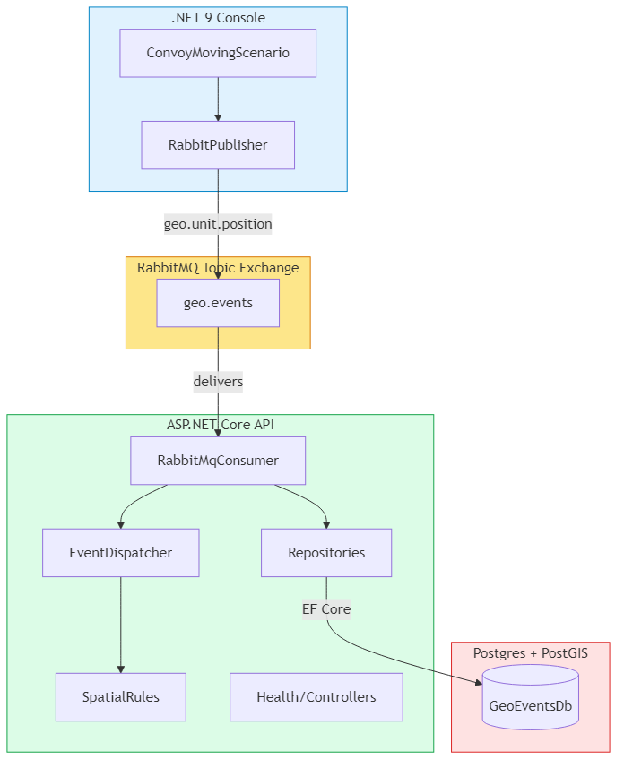

# Architecture Overview

This project is a real-time, message-driven geospatial event platform built with Clean Architecture. It processes simulator-originated geo events, applies spatial rules, persists to PostGIS, and exposes API endpoints for health, manual publish, and querying.

## High-Level Diagram

- 

- Simulator (Console, .NET 9)
  - Publishes `UNIT_POSITION` events to RabbitMQ exchange `geo.events` with routing key `geo.unit.position`
  - Exposes a lightweight metrics server (`/metrics`, `/health`, `/dashboard`) for visibility
- Messaging (RabbitMQ)
  - Topic exchange: `geo.events`
  - Routing keys: `geo.unit.position`, `geo.sensor.alert`, `geo.zone.violation`
- API (ASP.NET Core)
  - Hosts RabbitMQ consumer background service
  - Receives messages, validates, applies spatial rules, persists to Postgres/PostGIS
  - Endpoints for Health, Units, Zones, Events
- Persistence (Postgres + PostGIS)
  - EF Core 9 with NetTopologySuite (SRID 4326)
  - Entities for Unit, Zone, GeoEvent

## Clean Architecture Layers

- Domain: Entities, value objects (GeoCoordinate, Heading, Velocity), domain events; no external dependencies.
- Application: Use-case abstractions and DTOs, mapper, spatial rules (`ISpatialRule` implementations), event dispatcher.
- Infrastructure: Messaging (RabbitMQ publisher/consumer), Persistence (EF Core DbContext, repositories), Idempotency store.
- API: DI composition, controllers, health checks, OpenAPI; wires infrastructure + application.

## Message Flow

1. Simulator generates `UnitPositionEventDto` with deterministic movement.
2. Simulator publishes to RabbitMQ topic exchange `geo.events` with `geo.unit.position`.
3. API background consumer receives messages, validates, checks idempotency, maps DTO → domain.
4. Application rules engine evaluates spatial rules (e.g., Zone violation, proximity) using PostGIS-aware queries or code-driven checks.
5. Infrastructure persistence writes results to Postgres (geometry using SRID 4326, GiST indexes).

## Spatial Considerations

- Prefer bounding-box (`&&`) prefilter before precise geometry functions.
- Use PostGIS functions: `ST_DWithin`, `ST_Intersects`, `ST_Buffer`.
- Ensure geometry columns have GiST indexes; migrations provide examples.

## Security & Safety

- Input validation and size limits on messages.
- Avoid logging sensitive payloads.
- Config via environment variables, no secrets committed.

## Ports & Services

- Postgres: host `localhost:5433` → container `5432`
- RabbitMQ: `localhost:5672` (AMQP), `localhost:15672` (Mgmt UI)
- API: `http://localhost:5045`
- Simulator metrics: `http://localhost:9090/{health|metrics|dashboard}`

> Note: If `docs/images/architecture.png` is missing, generate it from `docs/images/architecture.mmd` using Mermaid CLI:

```powershell
Push-Location "C:\_burhan\_projects\military-grade-geo-event-platform\docs\images"
npm install -g @mermaid-js/mermaid-cli
mmdc -i architecture.mmd -o architecture.png -t default -b transparent
```

## Scaling Hints

- Use topic exchanges and routing for selective consumption.
- Batch DB writes for high throughput; consider COPY for bulk inserts.
- Partition queues by stream type and shard consumers.
